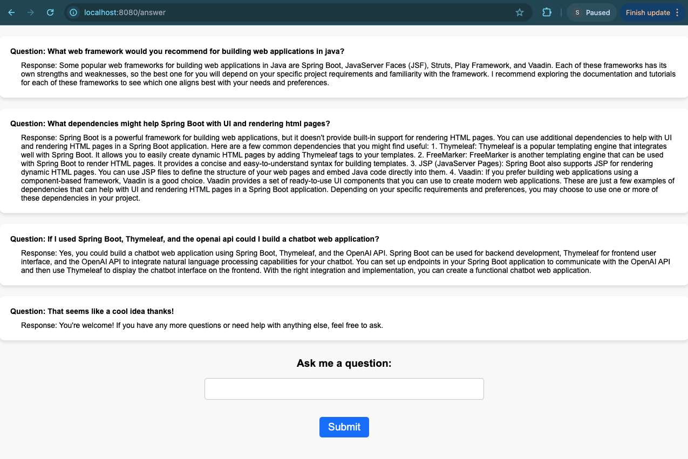
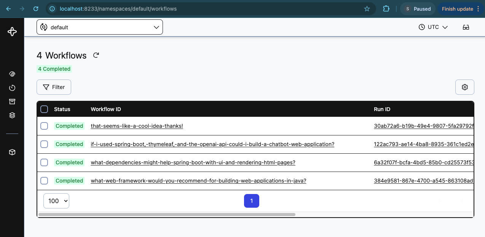

# README

This repository is a Java Spring Boot Application that demonstrates how to use Temporal and OpenAI to build a simple chatbot. 
This project is inspired from Patrick Rachford's python based Flask application at [https://github.com/rachfop/temporal-openai](url) but this project instead uses the Spring Boot framework and Thymeleaf to build a chatbot web application in Java.
This application uses Temporal to ensure durable execution of our chatbot by implementing a workflow that uses an activity to call the OpenAI API to generate responses to user questions.

## Running the application

### Prerequisites:

- Java 17
- [Maven 4.0.0](https://maven.apache.org/download.cgi)
- [Local Temporal server running](https://docs.temporal.io/application-development/foundations#run-a-development-cluster)
- [Open AI keys](https://platform.openai.com/account/api-keys)  
  - Unfortunately, Openai api keys are not free to use, so payment is required for your api key to function.
If you are curious to see this application run but are not interested in paying openai for a key, this repository holds images
of a demo run (featured below) or you can feel free to email me at [seantsullivan04@gmail.com](mailto) and I will be happy to share
more information about this project.

With this repository cloned, run the following at the root of the directory:

```Bash
mvn compile
```

### Steps to run the application
1. Start the Temporal server by running `temporal server start-dev`.  

2. In a new terminal window, save your openai key to the OPENAI_API_KEY environment variable by running  
&emsp;&emsp;`export OPENAI_API_KEY=YourSecretKey` for macOS  
&emsp;&emsp;OR  
&emsp;&emsp;`set OPENAI_API_KEY=YourSecretKey` for Windows  

3. Then in the same terminal window, start the worker by running `mvn compile exec:java -Dexec.mainClass="temporalOpenai.OpenaiWorker"`.  
   
4. In another terminal window, start the Spring application by running `mvn compile exec:java -Dexec.mainClass="temporalOpenai.Starter"`.  
   
5. Open your web browser and go to `http://localhost:8080`.  

## UI

Interact with the model with the Spring UI.



See the results from Temporal's Web UI at: <http://localhost:8233/>.  



## Files

### OpenaiActivities.java  ->  OpenaiActivitiesImpl.java

OpenaiActivitiesImpl is the implementation of the OpenActivities interface which defines the only activity in our workflow `getResponse()`.
This activity takes in a Question object as a parameter and returns a string representing openai's chatbot reponse.
This is achieved through a http POST request of a json formatted string to api.openai.com.

### OpenaiWorkflow.java  ->  OpenaiWorkflowImpl.java

OpenaiWorkflowImpl is the implementation of the OpenaiWorkflow interface which outlines our workflow function `chat()`. 
Our workflow function accepts a question string and returns a response string by converting our question string to a Question object and passing it to our `getResponse()` activity, then returning openai's response or an error message if `getResponse()` throws an error.

### Question.java

This file is a simple object to hold a question and an answer string. When using Temporal, it is reccomended to pass objects through activities, to improve backwards-compadability, but this object also serves as an individual record for the chat history.

### Starter.java

This file defines a Spring Boot application that utilizes Thymeleaf to render an html template for the user interface to the chatbot.
When the user submits a question, the application creates an instance of `OpenAIWorkflow` and executes it using the Temporal client.
The application then displays the user's question and the response generated by the chatbot as well as the chat history.

### OpenaiWorker.java

This file starts the Temporal worker, which listens for and executes workflows and activities. It uses the `getResponse()` activity and the `OpenaiWorkflow` workflow.
